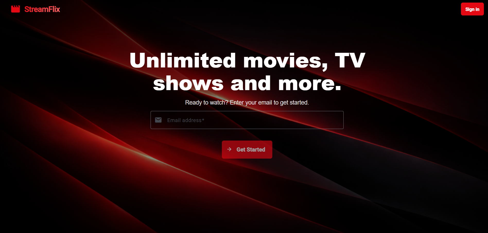
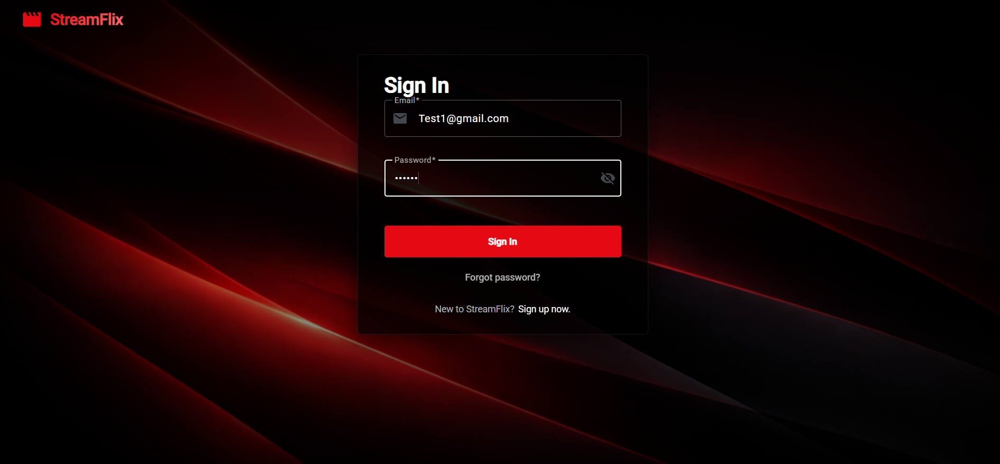
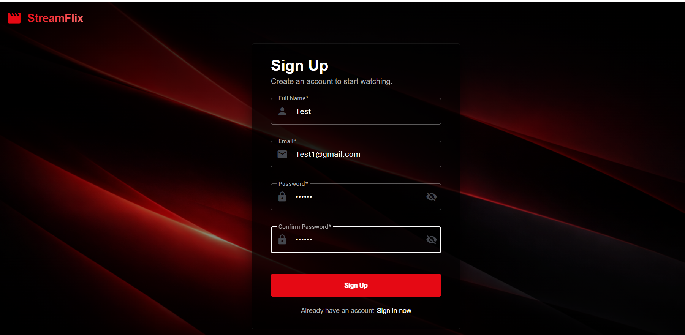
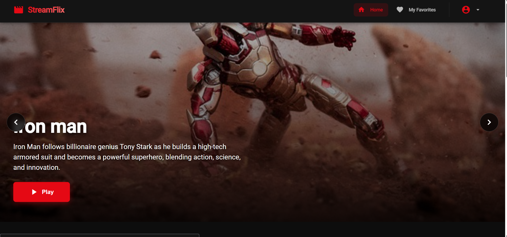
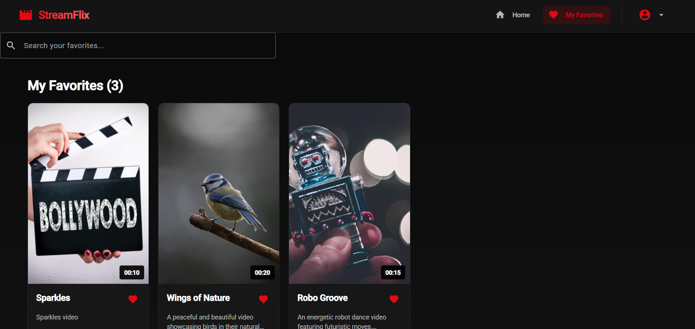
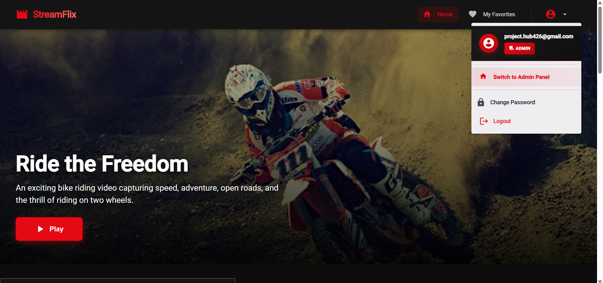
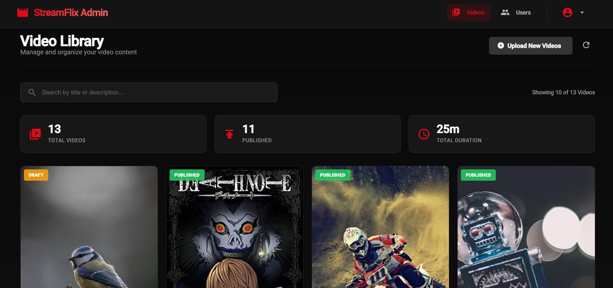
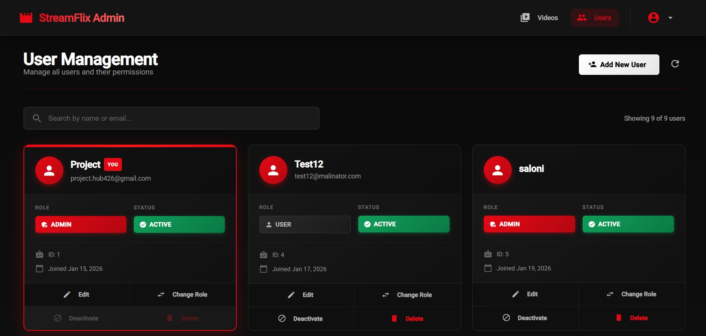
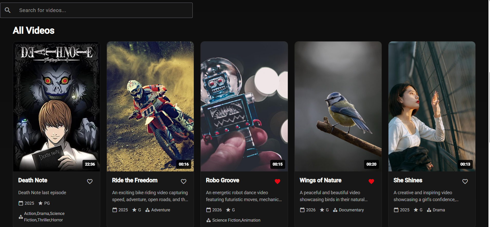

# 🎬 StreamFlix

A  **full‑stack video streaming platform** inspired by Netflix, built with **Angular (Frontend)** and **Spring Boot (Backend)**. StreamFlix supports **secure authentication, role-based access (Admin/User), video management, favorites, and a modern UI**.

## 🚀 Features

### 👤 Authentication & Security

* User Signup & Login with JWT authentication
* Email verification & forgot password flow
* Secure role-based access control (ADMIN / USER)

### 🧑‍💼 Admin Panel

* Admin dashboard with statistics
* User management (Add / Edit / Activate / Deactivate / Delete users)
* Change user roles (USER ↔ ADMIN)
* Video management (Upload, Publish, Draft)

### 🎥 Video Platform

* Browse all videos with rich UI cards
* Video categories & metadata
* Favorites (Add / Remove)
* Video player with smooth experience

### 💻 UI / UX

* Netflix‑inspired modern dark UI
* Fully responsive design
* Clean component-based Angular architecture


## 🛠️ Tech Stack

### Frontend

* **Angular**
* TypeScript
* HTML5 / CSS3
* JWT Interceptor & Route Guards

### Backend

* **Spring Boot**
* Spring Security + JWT
* REST APIs
* MySQL Database


## 📂 Project Structure

StreamFlix/
│── Frontend/        # Angular application
│── backend/         # Spring Boot backend
│── Screenshots/     # UI Screenshots for documentation
│── README.md
```

## 📸 Application Screenshots

### 🏠 Landing Page


---

### 🔐 Authentication

**Sign In**



**Sign Up**


---

### 👥 User Experience

**User Dashboard**



**My Favorites**



---

### 🧑‍💼 Admin Panel

**Switch to Admin Panel**



**User Management**



**Add New User**



---

### 🎬 Video Management

**Video Library**



---

## ⚙️ Environment Setup

### Backend (Spring Boot)

```properties
spring.datasource.url=jdbc:mysql://localhost:3306/streamflix
spring.datasource.username=root
spring.datasource.password=your_password
jwt.secret=your_secret_key
```

### Frontend (Angular)

```bash
ng serve --port 4200
```

---

## 🔒 Best Practices Followed

* JWT-based authentication
* Route guards for protected pages
* Role-based authorization
* Clean code & modular architecture
* Production-ready deployment setup

---

## 📌 Future Enhancements

* Video streaming optimization
* Subscription plans
* Watch history
* Recommendation system
* Cloud storage integration (AWS S3)

---

## 👩‍💻 Author

**Saloni Gawande**
Computer Engineering Student | Full‑Stack Developer 

📫 GitHub: [https://github.com/Saloni4105](https://github.com/Saloni4105)

---

⭐ If you like this project, don’t forget to **star the repository**!
